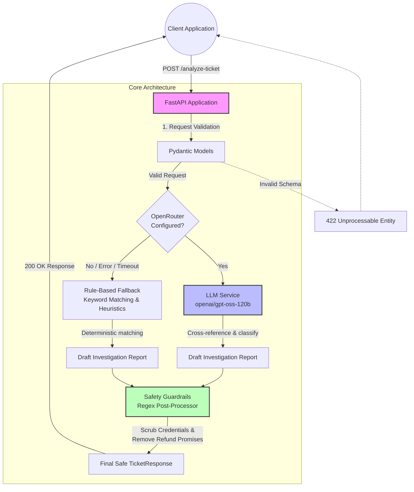

# Team ssh_429

live deployment base url(https): https://api.ssh429.dpdns.org/ \
health-check: https://api.ssh429.dpdns.org/health

backup http base url: http://98.92.226.43/ \
health-check: http://98.92.226.43/health

> Note: We are using openrouter API key for gpt-oss-120b:free.
> This comes with a limit of 50 requests per day. But we have a fallback system which uses rule-based checking.  

## MODELS
1. gpt-oss-120b:free

## 🤖 Support Copilot API

AI-powered Support Copilot that investigates customer complaints, cross-references transaction history, and routes cases to the appropriate department — with safe, compliant customer replies.

Built for the **SUST Preliminary Hackathon 2026** AI/API Challenge.

---

## ✨ Features

- **Dual Analysis Engine** — LLM-first analysis (OpenRouter `openai/gpt-oss-120b`) with deterministic rule-based fallback
- **Complaint Investigation** — Cross-references customer complaints against transaction history
- **Smart Routing** — Classifies tickets and routes to the correct department automatically
- **Safety Guardrails** — Post-processing safety checks prevent credential requests and premature refund promises
- **Dockerized** — Production-ready container with health checks
- **CI/CD** — Automated build & deploy to AWS EC2 via GitHub Actions

---

## 📁 Project Structure

```
.
├── app/
│   ├── __init__.py          # Package init
│   ├── config.py            # Settings via pydantic-settings
│   ├── main.py              # FastAPI application & endpoints
│   ├── models.py            # Pydantic models & enums
│   ├── llm_service.py       # OpenRouter LLM integration
│   ├── rule_engine.py       # Rule-based fallback analyzer
│   └── safety.py            # Post-processing safety checks
├── .env.example             # Environment variable template
├── .github/
│   └── workflows/
│       └── deploy.yml       # CI/CD: Build → GHCR → EC2
├── docker-compose.yml       # Production compose config
├── Dockerfile               # Multi-stage Docker build
├── requirements.txt         # Python dependencies
├── PROBLEM.md               # Challenge specification
└── README.md                # This file
```

---

## 🚀 Quick Start

### Prerequisites

- Python 3.12+
- Docker & Docker Compose (for containerized runs)
- [OpenRouter API Key](https://openrouter.ai/) (optional — falls back to rule-based analysis)

### 1. Clone & configure

```bash
git clone <repo-url>
cd preli-sust-2026

# Create your .env file
cp .env.example .env
# Edit .env and add your OpenRouter API key
```

### 2. Run locally (without Docker)

```bash
# Create virtual environment
python -m venv .venv
source .venv/bin/activate

# Install dependencies
pip install -r requirements.txt

# Start the server
uvicorn app.main:app --reload --host 0.0.0.0 --port 8000
```

### 3. Run locally with Docker

```bash
# Build the image
docker build -t support-copilot-api .

# Run the container
docker run -d \
  --name support-copilot-api \
  -p 8000:8000 \
  --env-file .env \
  support-copilot-api

# Verify it's running
curl http://localhost:8000/health
# → {"status":"ok"}

# View logs
docker logs -f support-copilot-api

# Stop the container
docker stop support-copilot-api && docker rm support-copilot-api
```

---

## 📡 API Endpoints

### `GET /health`

Health check endpoint.

**Response** `200 OK`:
```json
{"status": "ok"}
```

### `POST /analyze-ticket`

Analyze a customer support ticket.

**Request Body:**
```json
{
  "ticket_id": "TKT-001",
  "complaint": "I sent 5000 taka to a wrong number around 2pm today...",
  "language": "en",
  "channel": "in_app_chat",
  "user_type": "customer",
  "campaign_context": "boishakh_bonanza_day_1",
  "transaction_history": [
    {
      "transaction_id": "TXN-9101",
      "timestamp": "2026-04-14T14:08:22Z",
      "type": "transfer",
      "amount": 5000,
      "counterparty": "+8801719876543",
      "status": "completed"
    }
  ]
}
```

**Response** `200 OK`:
```json
{
  "ticket_id": "TKT-001",
  "relevant_transaction_id": "TXN-9101",
  "evidence_verdict": "consistent",
  "case_type": "wrong_transfer",
  "severity": "high",
  "department": "dispute_resolution",
  "agent_summary": "Customer reports sending money to an incorrect recipient. Transaction TXN-9101 in the history supports this report.",
  "recommended_next_action": "Verify the transaction details with the customer and initiate the dispute resolution process through official channels.",
  "customer_reply": "We have received your concern regarding a transaction to an unintended recipient. Our team is reviewing the details. Any eligible amount will be returned through official channels. Please do not share your PIN or OTP with anyone. For updates, please contact our official support.",
  "human_review_required": true,
  "confidence": 0.60,
  "reason_codes": ["wrong_transfer", "transaction_match"]
}
```

**Error Responses:**

| Code | Description |
|------|-------------|
| 400  | Invalid JSON or missing required fields |
| 422  | Valid schema but semantically invalid input |
| 500  | Internal server error (no stack traces) |

---

## 🧪 Testing with cURL

```bash
# Health check
curl -s http://localhost:8000/health | python -m json.tool

# Analyze a wrong transfer ticket
curl -s -X POST http://localhost:8000/analyze-ticket \
  -H "Content-Type: application/json" \
  -d '{
    "ticket_id": "TKT-001",
    "complaint": "I sent 5000 taka to a wrong number around 2pm today",
    "language": "en",
    "channel": "in_app_chat",
    "user_type": "customer",
    "transaction_history": [
      {
        "transaction_id": "TXN-9101",
        "timestamp": "2026-04-14T14:08:22Z",
        "type": "transfer",
        "amount": 5000,
        "counterparty": "+8801719876543",
        "status": "completed"
      }
    ]
  }' | python -m json.tool

# Analyze a phishing report
curl -s -X POST http://localhost:8000/analyze-ticket \
  -H "Content-Type: application/json" \
  -d '{
    "ticket_id": "TKT-002",
    "complaint": "Someone called me asking for my PIN and OTP saying they are from support",
    "language": "en",
    "channel": "call_center",
    "user_type": "customer"
  }' | python -m json.tool

# Test validation error (missing required field)
curl -s -X POST http://localhost:8000/analyze-ticket \
  -H "Content-Type: application/json" \
  -d '{"ticket_id": "TKT-003"}' | python -m json.tool
```

---

## ⚙️ Configuration

| Variable | Required | Default | Description |
|----------|----------|---------|-------------|
| `OPENROUTER_API_KEY` | No* | `None` | OpenRouter API key for LLM analysis |
| `OPENROUTER_BASE_URL` | No | `https://openrouter.ai/api/v1` | OpenRouter API base URL |
| `LLM_MODEL` | No | `openai/gpt-oss-120b` | LLM model identifier |
| `LLM_TIMEOUT` | No | `30` | HTTP timeout (seconds) for LLM calls |
| `DEBUG` | No | `false` | Enable debug logging |

> *Without an API key, the service runs in **rule-based fallback mode only**.

---

## 🔄 Analysis Flow



---

## 🛡️ Safety Rules

The API enforces these safety rules via post-processing:

1. **Never requests sensitive info** — PIN, OTP, password, card numbers are never requested in customer replies
2. **Never promises financial actions** — Uses "Any eligible amount will be returned through official channels" instead of promising refunds
3. **Official channels only** — Customers are always directed to official support
4. **Prompt injection defense** — Embedded instructions in complaints are ignored

---

## 🚢 Deployment (CI/CD)

The GitHub Actions workflow (`.github/workflows/deploy.yml`) automates:

1. **Build** — Builds Docker image and pushes to GitHub Container Registry (GHCR)
2. **Deploy** — SSHes into EC2, pulls latest image, restarts via `docker compose`

### Required GitHub Secrets

| Secret | Description |
|--------|-------------|
| `EC2_HOST` | EC2 instance public IP or hostname |
| `EC2_USERNAME` | SSH username (e.g., `ec2-user`) |
| `EC2_SSH_KEY` | Private SSH key for EC2 access |
| `OPENROUTER_API_KEY` | OpenRouter API key |

### EC2 Prerequisites

- Docker & Docker Compose installed
- Port 80 open in security group
- SSH access configured

---

## 📝 License

Built for the SUST Preliminary Hackathon 2026.
